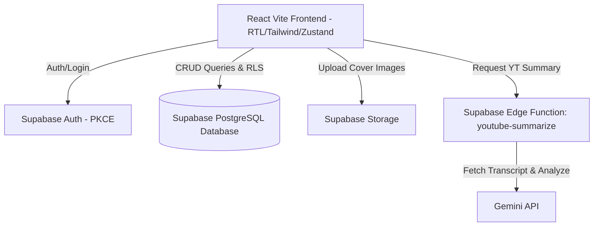

# Product Requirements Document (PRD) - Midad (مداد) Blogging Platform

## 1. Document Overview

- **Project Name:** Midad (مداد)
- **Status:** Active / In Development
- **Tech Stack:** React 18 (Vite), Supabase, Zustand, Tailwind CSS, Framer Motion, Tiptap, Playwright, Vitest
- **Target Audience:** Arabic-speaking writers, content creators, and readers.
- **Design Philosophy:** Modern, vibrant, Arabic-first (RTL), highly interactive, mobile-first design.

---

## 2. Product Vision & Mission

Midad (مداد) is a modern, feature-rich Arabic blogging platform designed to revitalize online writing and reading in the Arab world. By merging high-quality, long-form written articles with the engaging, dynamic micro-interactions found on modern social media platforms (such as real-time reactions, follower networks, customized channel spaces, and AI-powered transcript imports), Midad provides a premium, fluid, and immersive environment for authors to grow their audience and for readers to enjoy content distraction-free.

---

## 3. User Roles & Access Control Matrix

The platform defines three main user roles:

1. **Reader (القارئ)**: Default registered user. Can browse, read, search, react, follow creators, save posts, comment, and subscribe to newsletters.
2. **Creator/Author (الكاتب/المبدع)**: Upgrade-approved account. Can write, edit, delete their own posts, manage playlists (collections), configure channel-level settings, view creator analytics, and import/summarize YouTube videos.
3. **Admin (المدير/المشرف)**: System administrator. Full database access, handles creator requests, generates invite codes, moderates all comments and posts, updates site-wide configurations, and manages user roles/ban statuses.

### Access Control Matrix

| Feature / Resource                | Guest / Anon | Reader | Author / Creator |   Admin   |
| :-------------------------------- | :----------: | :----: | :--------------: | :-------: |
| Browse & Read Published Posts     |     Yes      |  Yes   |       Yes        |    Yes    |
| React & Comment                   |      No      |  Yes   |       Yes        |    Yes    |
| Follow Authors & Save Posts       |      No      |  Yes   |       Yes        |    Yes    |
| Create/Edit/Delete Own Posts      |      No      |   No   |       Yes        |    Yes    |
| Manage Collections/Playlists      |      No      |   No   |       Yes        |    Yes    |
| Creator Dashboard & Analytics     |      No      |   No   |    Yes (Own)     | Yes (All) |
| Channel Branding & Site Settings  |      No      |   No   |    Yes (Own)     | Yes (All) |
| Approve Creator Requests          |      No      |   No   |        No        |    Yes    |
| Generate Invite Codes             |      No      |   No   |        No        |    Yes    |
| Moderate User Profiles (Ban/Role) |      No      |   No   |        No        |    Yes    |

---

## 4. Key Functional Requirements & Features

### 4.1 Authentication & Profiles

- **Authentication Flow:** Built on Supabase PKCE flow. Secure credentials verification with local session caching (`sb-auth-token`).
- **Profile Customization:** Users can set their Full Name, Avatar URL, Bio, and Channel Slug.
- **Gamification & Levels (نظام المستويات والنقاط):**
  - Designed to incentivize writing and high-quality contributions.
  - Creators earn points (default: 10 points per published article) via database triggers (`increment_user_points`).
  - User profiles display badges and user level progression in the user profile page.

### 4.2 Interactive Creator Studio (لوحة تحكم المبدعين)

- **Article Writing & Publishing (Editor):**
  - Integrated with Tiptap Editor, supporting rich formatting, links, images, YouTube embeds, and real-time character/word counts.
  - Excerpt generation, custom cover image URLs, and scheduling capabilities.
  - DOMPurify integration sanitizes rich text on save to prevent XSS.
- **Post Management:** Complete CRUD interface for authors to manage their drafts, published articles, and scheduled posts.
- **Playlists/Collections (قوائم التشغيل):**
  - Organizes articles sequentially into structured chapters, courses, or series (e.g. Part 1, Part 2).
  - Exhibited on the frontend in a grid resembling video playlists with total parts count.
- **Analytics Dashboard:**
  - Visualize key indicators (total views, likes, reactions, reading times).
  - Uses Recharts to plot views and engagement statistics over time (filtered for own posts for authors, system-wide for admins).
- **Channel Customization:** Creators customize their public channel branding, including channel name, description, logo/avatar, footer texts, and social handles, mapping to individual sub-channels.

### 4.3 Social & Reader Interactions

- **Facebook-like Reactions:** Floating toolbar allows readers to react with one of five emotions: Likes 👍, Love ❤️, Haha 😂, Sad 😢, and Angry 😡.
- **Comments Section:** Threaded, nested comment trees with comment approval controls. Creators can toggle comment locks per post.
- **Follower Network:** Readers can follow authors to get updates.
- **Bookmarks (Saved Posts):** Personal library for users to bookmark articles for offline or future reading.
- **Newsletter Subscription:** Simple footer newsletter capture linked to the database.

### 4.4 Smart YouTube Scraper & Summarizer

- **Transcript Extraction:** Allows authors to insert a YouTube Video URL in the editor.
- **Gemini-Powered Summarization:** Sends video transcription requests to an Edge Function that interfaces with Gemini API, automatically producing structured draft blog posts (converting speech-to-text summaries in Arabic).

### 4.5 Global Smart Search

- A pop-up search interface that filters posts instantly based on titles, excerpt, tags, or categories using PostgreSQL full-text search capability (`search_vector` column).

---

## 5. Technical Architecture & Database Design

### 5.1 Technical Architecture

### 5.2 Core Database Schema Highlights

The platform's relational DB is defined in PostgreSQL. The major tables include:

- `profiles`: Extends Supabase auth. Contains full name, email (secured), bio, role, points, is_banned.
- `posts`: Stores blog entries with details like cover image, slug, tags array, status, view counters, read time, and full-text search index (`search_vector`).
- `comments`: Nested comment tables with hierarchical relations (`parent_id`) and moderation flags.
- `post_reactions`: Tracks user-specific reactions mapped to a post.
- `collections` & `collection_posts`: Represents playlists and their sequential posts maps.
- `follows`: Links follower profile IDs to followed author profile IDs.
- `notifications`: Keeps track of user alerts (e.g., updates on comments, followers, etc.).
- `site_settings`: Global configurations for customized individual author pages.
- `invite_codes` & `creator_requests`: Gatekeeping mechanisms for upgrading roles.

---

## 6. Non-Functional & Design Quality Requirements

### 6.1 Arabic-First Localization (RTL)

- Full Arabic interface (`dir="rtl"`, `lang="ar"`).
- Dates formatted according to local Egyptian/Middle Eastern formats using `Intl.DateTimeFormat('ar-EG')`.
- Styled with responsive typography tuned for Arabic characters.

### 6.2 Premium Aesthetics & Micro-Animations

- Custom dark/light themes managed via Tailwind's `class` mechanism.
- Soft transitions, glassmorphic layouts, floating control bars for mobile, and modern gradients.
- Micro-interactions implemented through Framer Motion to animate likes, menu entries, and modal transitions.

### 6.3 Performance & Mobile Optimizations

- **Mobile-First Responsiveness:** Layouts resemble native mobile applications (bottom navigation bar, full-screen side menus).
- **Code Splitting:** Dynamic imports using `React.lazy` and `Suspense` keep the initial load bundle size under 50KB.
- **Client Cache Optimization:** React Query caches server responses to prevent redundant SQL requests on navigation.

### 6.4 SEO & Safety

- Dynamic tags injected into headers via `react-helmet-async`.
- Rich markup and semantic structures (`<article>`, `<header>`, `<main>`, `<h1>`).
- DOMPurify strips malicious HTML from blogs and comments before database storage.

### 6.5 Testing & CI/CD Pipeline

- **Unit and Integration Testing:** Powered by Vitest (over 660 tests verifying services, hooks, stores, and layouts with an 80% coverage threshold).
- **E2E Smoke Tests:** Playwright verify key user flows (e.g. main page and login operations).
- **Automation:** GitHub Actions runs all linters and tests on pull request, and triggers daily database backups to a private repo.

---

## 7. Known Risks, Security Vulnerabilities & Future Backlog

Based on codebase audits, the following issues are high-priority backlog items:

1. **Row Level Security (RLS) Gaps:** Ensure strict RLS policies on all core tables (such as `posts`, `comments`, `saved_posts`, `invite_codes`, `creator_requests`) to prevent authenticated readers from deleting or updating other users' records.
2. **Gemini API Key Exposure:** The Gemini API key (`VITE_GEMINI_API_KEY`) is currently bundled in the client bundle. A secure migration must route Gemini requests solely through server-side edge functions.
3. **Unauthenticated Edge Functions:** The `youtube-summarize` function lacks JWT verification. Restrict endpoint requests to verified creator accounts.
4. **Scraping Proxy Dependence:** YouTube scraping uses third-party CORS proxy (`corsproxy.io`) which is highly fragile. Move to a stable server-side parser.
5. **State Management Syncing:** Trending and hero post configurations currently reside in `localStorage` in the creator portal instead of table records. These should be saved directly in `site_settings`.
